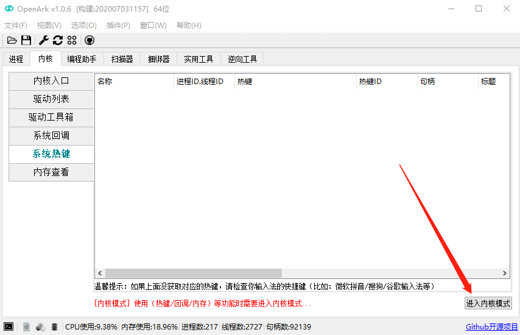
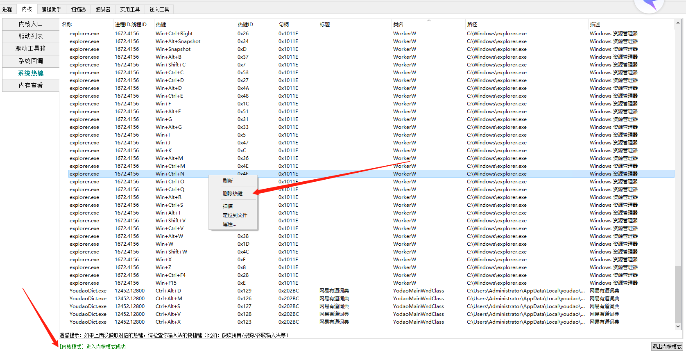

# 查看被占用的系统热键

## 介绍

经常会遇到系统热键/快捷键被占用，但是不知道被谁占用。OpenArk现已加入可以枚举和摘除系统热键的功能，支持Win7/Win8/Win8.1/Win2012/Win2016/Win10 (~2004) x86/x64 Win7及以上所有版本)。

## 使用步骤

### 进入内核模式

* 右下角进入内核模式，会安装驱动，如果杀毒软件提示，需放行。进入内核模式，安装驱动成功后会变为绿色。

### 查看对应热键

* 如图所示，热键可以排序，可以删除，定位等。

## 结束语
注意：如果上面没获取对应的热键，请检查你输入法的快捷键（比如：微软拼音/搜狗/谷歌输入法等），因为输入法的快捷键是单独管理的，不在系统全局热键中。

OpenArk作为一款开源软件，功能在不断完善，读者可自行测试，也可来Github加入我们。

## 附录：特殊输入法快捷键

部分输入法（例如[搜狗输入法医生版](https://blog.csdn.net/roymno2/article/details/117019710)）会在注册表中添加特殊的快捷键。这类快捷键可在以下注册表位置找到：

- `HKEY_CURRENT_USER\Control Panel\Input Method\Hot Keys`
- `HKEY_CURRENT_USER\Software\Microsoft\CTF\DirectSwitchHotkeys`（搜狗输入法医生版的修改位置）

表项目的含义可以参考[链接 1](https://bbs.pcbeta.com/viewthread-616220-1-1.html)、[链接 2](https://wenku.baidu.com/view/18a16df5c2c708a1284ac850ad02de80d4d806b8)、[链接 3](https://www.ptt.cc/bbs/Windows/M.1445150397.A.E05.html)。本节链接均已在 Wayback Machine 存档。
