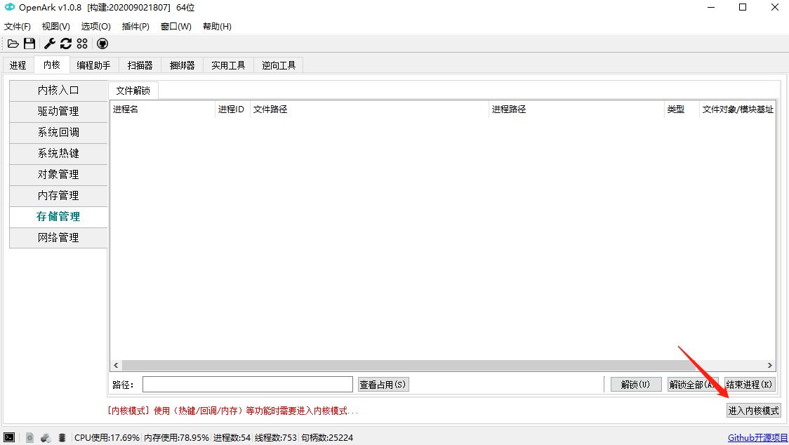
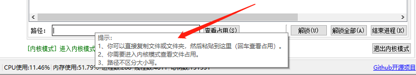
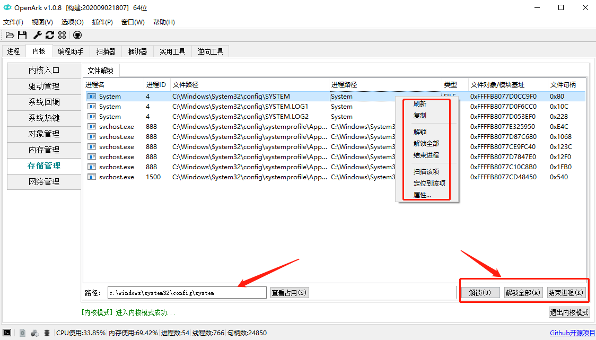

# 解锁被占用的文件

## 介绍
经常会遇到文件或文件夹被占用，但是却不知道被谁占用着，故OpenArk加入了类似Unlocker(老一代软件)的文件解锁功能，能够快速地帮用户解决文件占用问题。

## 使用步骤
### 进入内核模式
* 右下角进入内核模式，会安装内核驱动，如果杀毒软件提示，需放行。进入内核模式成功后会变为绿色。

### 输入文件路径
* 左下角中输入文件路径，其中路径支持模糊匹配，不区分大小写。

### 解锁文件
* 按回车键或点击"查看占用"，界面就会列出匹配到的被占用项目，展示相关进程、文件路径、文件句柄、文件对象、模块地址等信息。
* 其中展示结果分为两种类型，一种是FILE类型，表示是文件被其他程序打开占用；另外一种是DLL类型，表示DLL类型的文件被其他程序加载占用。
* 获得结果之后，可以使用右键菜单或者右下角的功能按钮进行操作。

## 结束语
由于某些程序的自身实现逻辑，解锁某些文件后，会导致该程序退出；另外有时候结束相关的进程也许不够优雅，但是却是一种比较实用的方式。

OpenArk作为一款开源软件，功能在不断完善，读者可自行测试，也可来Github加入我们。