# 查看PE文件结构

## 介绍

PE文件是Windows下的可执行程序，与之对应的是Linux下的ELF，macOS下的Mac-O，都是遵从COFF结构标准，两个基本要素是：头Header + 区段（Section），头是属于Meta数据，区段是具体内容。

PE文件结构大致如下图所示：

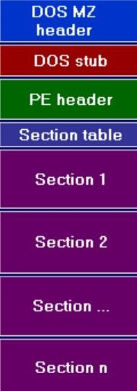

## 使用方法

* 可从进程列表或模块列表，右键Sendto Scanner
* 可在Scanner标签页上，直接打开PE
* 直接拖动PE文件到窗口中（内置管理员模式）

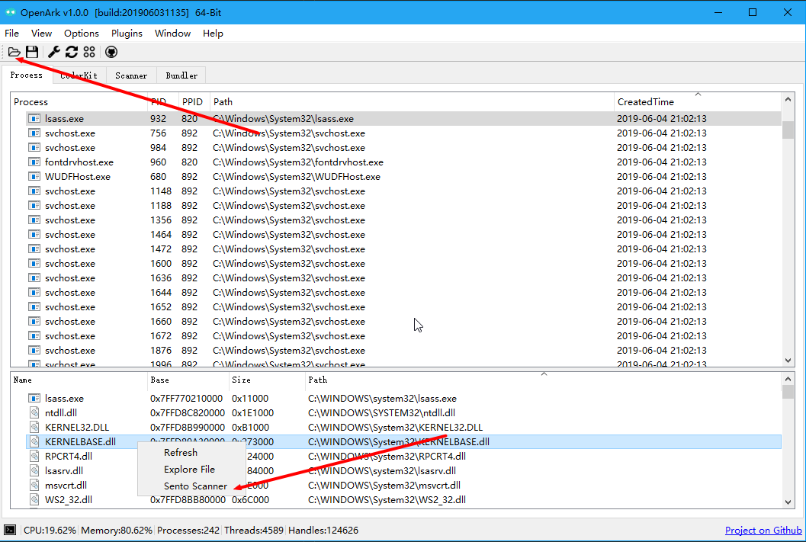

## 查看基本信息

这里可看到PE文件的大小、版本、描述、编译时间、PDB、编译器等信息。

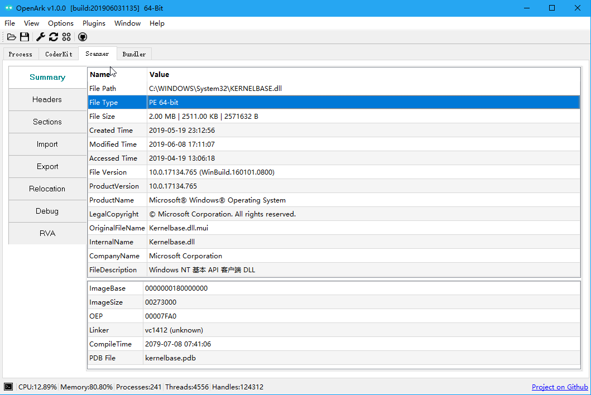

## 查看DOS头
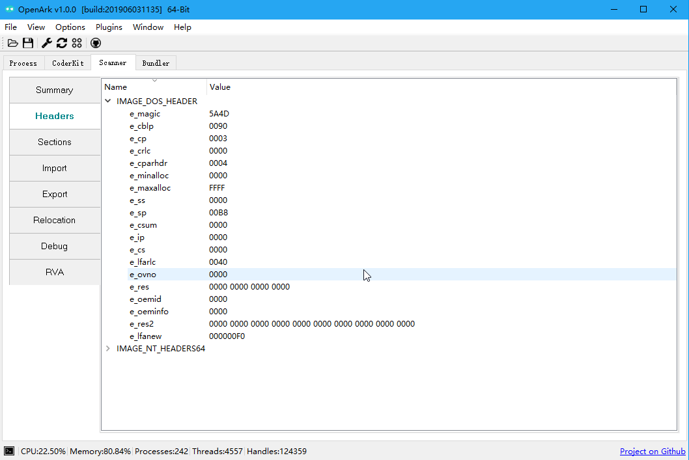

## 查看PE头
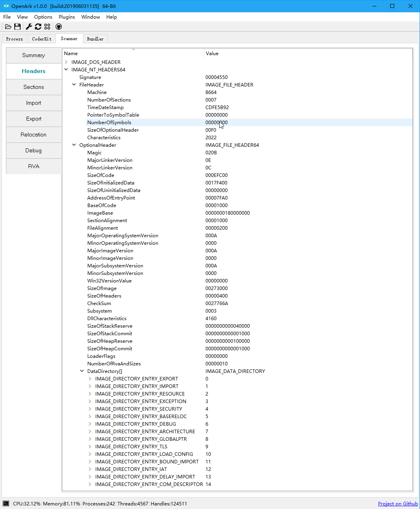

## 查看区段表
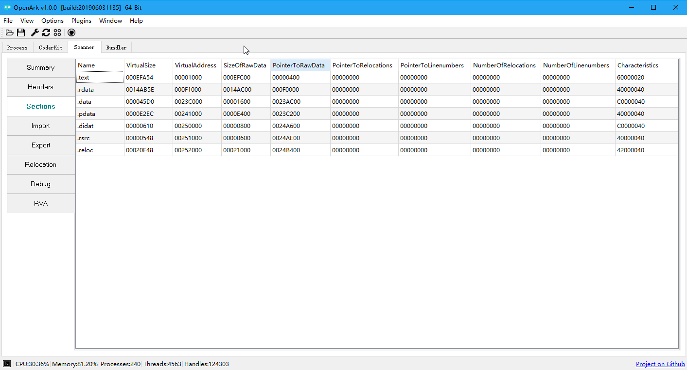

## 查看导入表
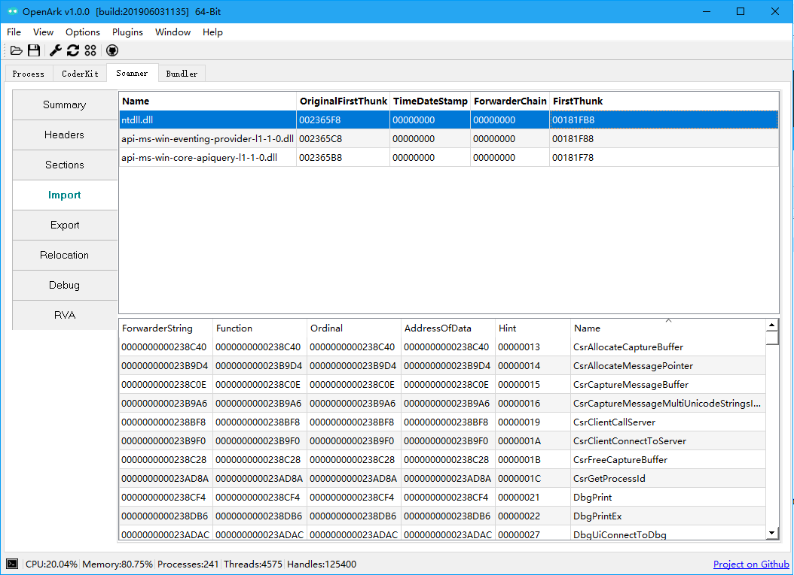

## 查看导出表
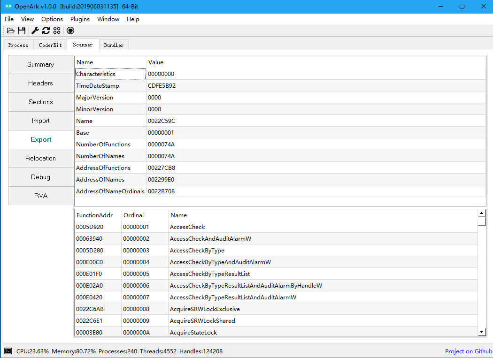

## 查看重定位表
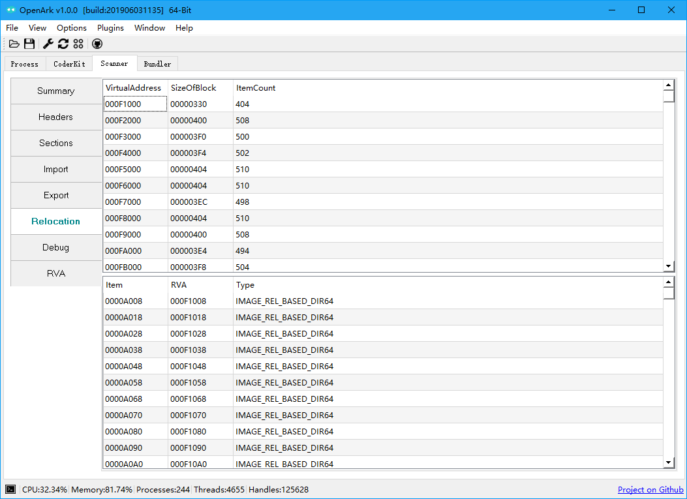

## 查看调试目录

SymbolID和windbg的下载符号路径是一致的。

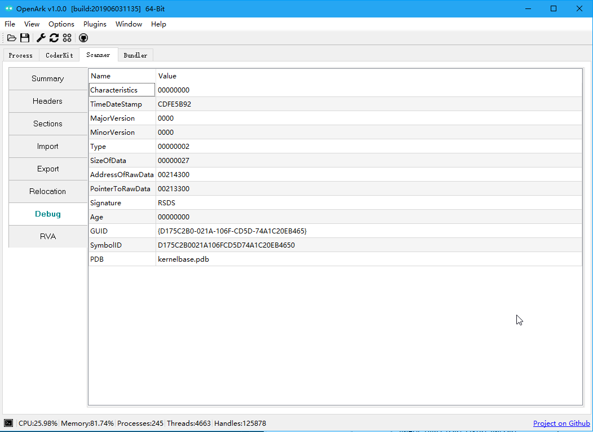

## 其他信息（资源/延迟绑定等等）
[TODO] OpenArk查看功能后续会更新。

## 查看RVA
RVA = 偏移地址VA - 基址ImageBase， R即是Relative(相对)。

这里的Rebase常在使用IDA和Windbg时，ASLR导致的基址重定位，用于临时转换。

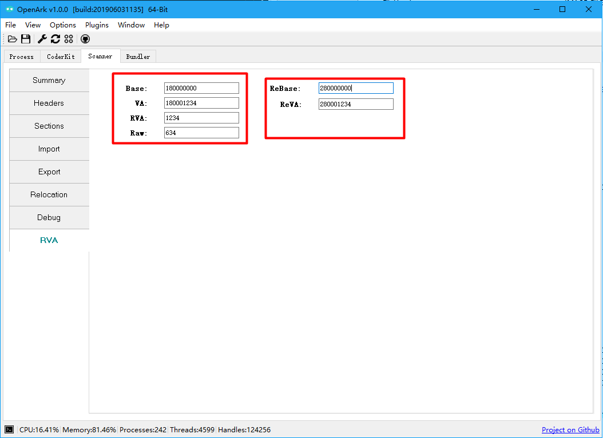
