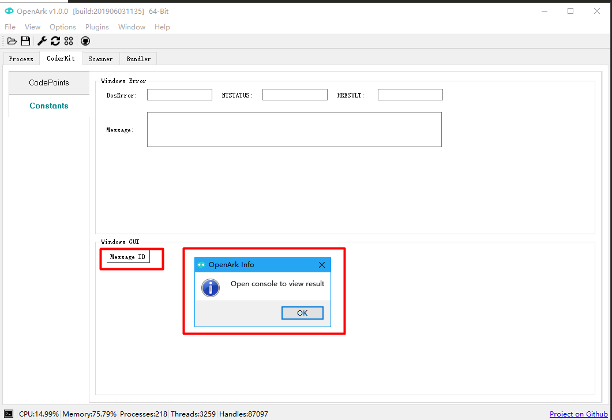
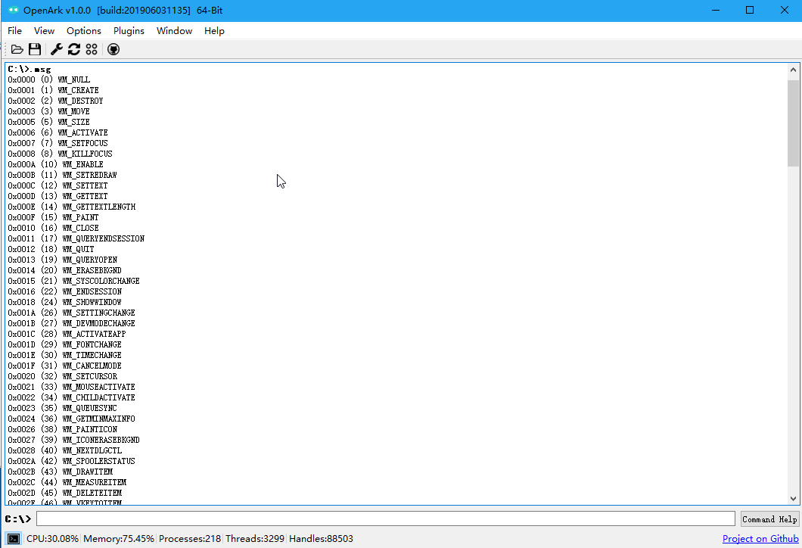

# 查看窗口消息ID

查看消息处理过程函数原型，窗口消息ID即是uMsg，通常我们逆向分析跟踪消息处理过程时经常会用到。
```
LRESULT CALLBACK WindowProc(
  _In_ HWND   hwnd,
  _In_ UINT   uMsg,
  _In_ WPARAM wParam,
  _In_ LPARAM lParam
);
```

查看所有消息ID，可通过.msg命令。




查看.msg使用说明：
```
C:\>.help .msg
.msg - show window message id
.msg [show message id list]
.msg -name button [show message name matched *button*, eg:WM_LBUTTONDOWN...]
.msg -id 201/0x201/0n513 [implies WM_LBUTTONDOWN]
```

搜索某类消息，则可输入.msg -name button，模糊匹配
```
C:\>.msg -name button
0x00A1 (161) WM_NCLBUTTONDOWN
0x00A2 (162) WM_NCLBUTTONUP
0x00A3 (163) WM_NCLBUTTONDBLCLK
0x00A4 (164) WM_NCRBUTTONDOWN
0x00A5 (165) WM_NCRBUTTONUP
0x00A6 (166) WM_NCRBUTTONDBLCLK
0x00A7 (167) WM_NCMBUTTONDOWN
0x00A8 (168) WM_NCMBUTTONUP
0x00A9 (169) WM_NCMBUTTONDBLCLK
0x0122 (290) WM_MENURBUTTONUP
0x0201 (513) WM_LBUTTONDOWN
0x0202 (514) WM_LBUTTONUP
0x0203 (515) WM_LBUTTONDBLCLK
0x0204 (516) WM_RBUTTONDOWN
0x0205 (517) WM_RBUTTONUP
0x0206 (518) WM_RBUTTONDBLCLK
0x0207 (519) WM_MBUTTONDOWN
0x0208 (520) WM_MBUTTONUP
0x0209 (521) WM_MBUTTONDBLCLK
```

也可通过值反查名称
```
C:\>.msg -id 0x201
0x0201 (513) WM_LBUTTONDOWN
```