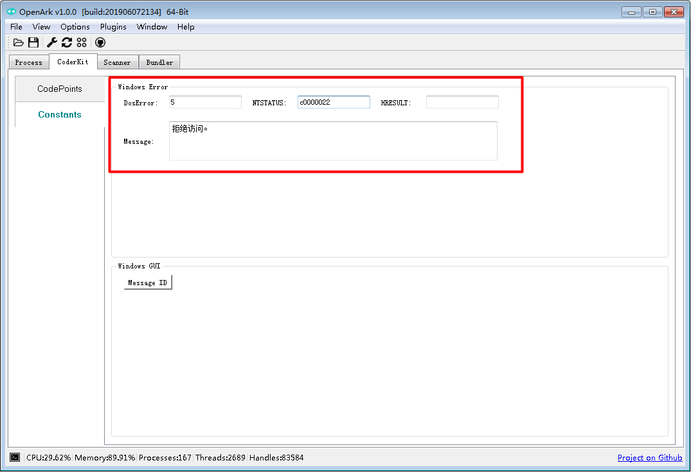

# 系统错误值查看

可使用图形化工具，也可使用.err命令.

图形化工具：


查看.err命令使用说明：
```
C:\>.help .err
.err - show LastError or NTSTATUS
.err 2 [show LastError]
.err -s c0000034 [show NTSTATUS]
```

查看LastError
```
C:\>.err 2
系统找不到指定的文件。
```

查看NTSTATUS
```
C:\>.err -s c0000022
拒绝访问。
```