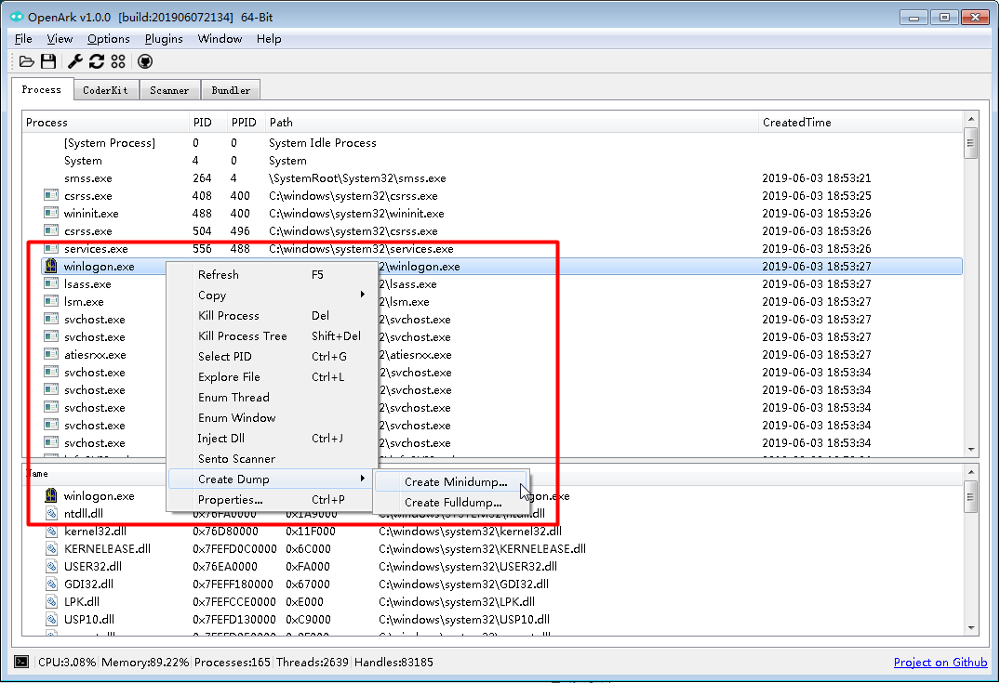

# 创建进程Dump

## Dump介绍
Dump文件是进程或系统的快照，对于进程Dump来说，里面包含进程的各种信息，主要包括异常信息、模块、内存信息、句柄、线程等可选信息。Linux上与之对应的是Core文件。

Dump又分Minidump和Fulldump，Minidump文件小，信息量少，便于传输。Fulldump文件大，信息量多，不便传输。根据实际情况选择即可，遵从够用原则。

## 分析工具
Windows上一般使用Windbg，Linux一般使用gdb，对于Linux的Core文件来说几乎是内存VMA信息，里面含有的元信息极少，因此多数发行版如CentOS都会有自己的Dump程序，保存LWP状态、fd等信息。Windows下的Dump这些信息基本上很全，可使用API MiniDumpWriteDump 通过参数设置。

## 进程Dump实例
使用OpenArk，选定进程，右键创建Dump，可选Fulldump或Minidump，一般进程内存使用不多的情况下，Dump都选Fulldump。

