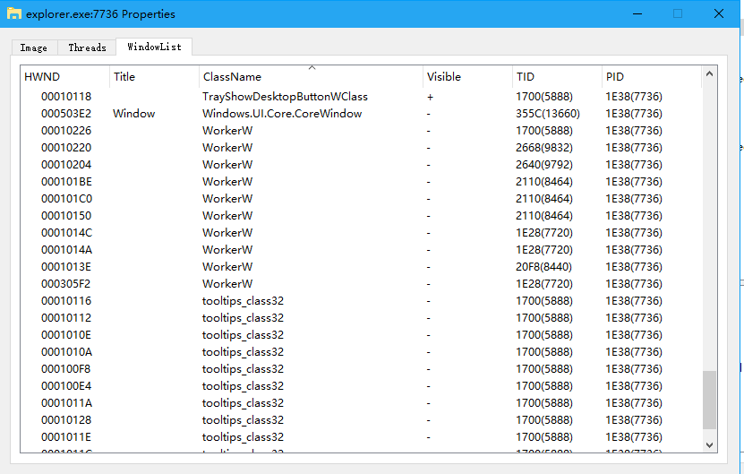

# 查看进程窗口

在进程列表双击（或者右键查看Properties），选择WindowList，如下：




也可通过命令操作，查看.wnd使用说明：
```
C:\>.help .wnd
.wnd - show window information
.wnd [show system window list]
.wnd -title Worker [show window title name matched *Worker*]
.wnd -class Worker [show window class name matched *Worker*]
.wnd -hwnd 778BC/0x778BC/0n489660 [show HWND=778BC window information]
.wnd -pid 8880 [show process pid=8880 window list]
out: [hwnd] [parent hwnd] [title] [class] [pid.tid] [process name]
```

查看某个进程的窗口：
```
C:\>.wnd -pid 0n7736
000102F8 000102EE [] [ApplicationFrameTitleBarWindow] [1E38.2A50] explorer.exe
000102F6 000102EE [] [ApplicationFrameTitleBarWindow] [1E38.2A50] explorer.exe
000102FA 000102EE [] [ApplicationFrameInputSinkWindow] [1E38.2A50] explorer.exe
000102DE 000202D4 [] [ApplicationFrameTitleBarWindow] [1E38.2A2C] explorer.exe
000102DC 000202D4 [] [ApplicationFrameTitleBarWindow] [1E38.2A2C] explorer.exe
000102E0 000202D4 [] [ApplicationFrameInputSinkWindow] [1E38.2A2C] explorer.exe
000102CA 000202BA [] [ApplicationFrameTitleBarWindow] [1E38.2A08] explorer.exe
000102C8 000202BA [] [ApplicationFrameTitleBarWindow] [1E38.2A08] explorer.exe
000102CC 000202BA [] [ApplicationFrameInputSinkWindow] [1E38.2A08] explorer.exe
000102AC 000302A2 [] [ApplicationFrameTitleBarWindow] [1E38.29DC] explorer.exe
000102AA 000302A2 [] [ApplicationFrameTitleBarWindow] [1E38.29DC] explorer.exe
000102AE 000302A2 [] [ApplicationFrameInputSinkWindow] [1E38.29DC] explorer.exe
00010292 00020286 [] [ApplicationFrameTitleBarWindow] [1E38.297C] explorer.exe
00010290 00020286 [] [ApplicationFrameTitleBarWindow] [1E38.297C] explorer.exe
00010294 00020286 [] [ApplicationFrameInputSinkWindow] [1E38.297C] explorer.exe
00020060 00020038 [] [ApplicationFrameTitleBarWindow] [1E38.25D0] explorer.exe
00030056 00020038 [] [ApplicationFrameTitleBarWindow] [1E38.25D0] explorer.exe
0002005E 00020038 [] [ApplicationFrameInputSinkWindow] [1E38.25D0] explorer.exe
00010188 00000000 [] [ForegroundStaging] [1E38.221C] explorer.exe
0001015C 00000000 [] [ForegroundStaging] [1E38.2110] explorer.exe
.....
```

也可根据标题和类名搜索系统中任意窗口
```
C:\>.wnd -title wo
0001022A 00010228 [Network Flyout] [ATL:00007FFF5E257230] [1E38.266C] explorer.exe
0002053E 000201F4 [UIRibbonWorkPane] [UIRibbonWorkPane] [0A98.0E78] explorer.exe
```