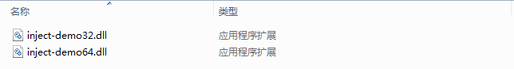
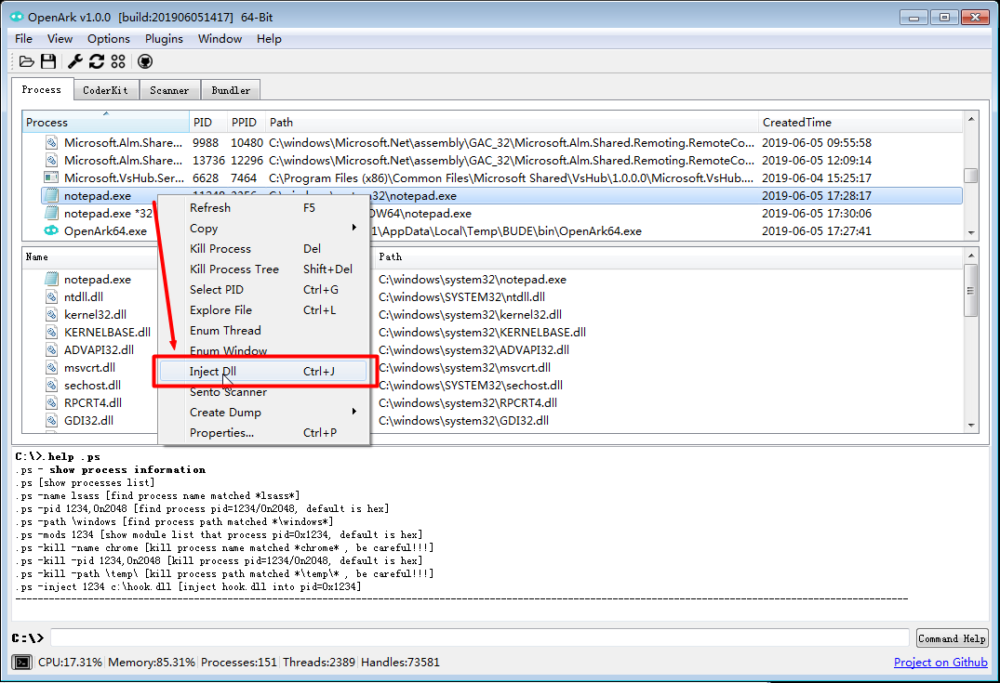
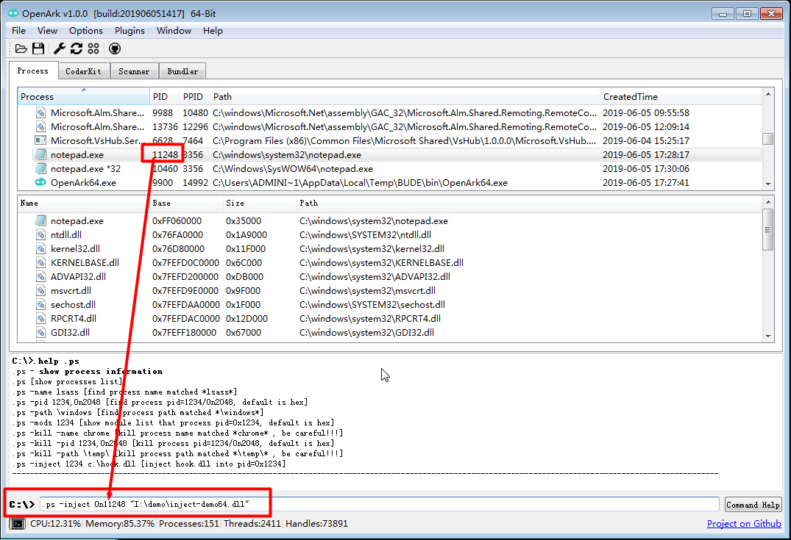
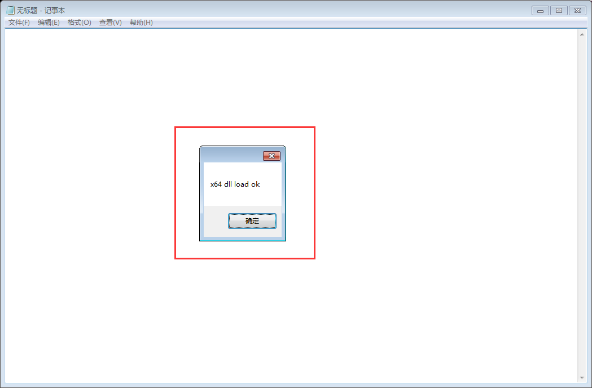

# 注入Dll到进程

### 创建进程
* 打开64位计算器：C:/windows/system32/notepad.exe
* 打开32位计算器：C:/windows/SysWOW64/notepad.exe

刷新进程列表能看到两个，*32 代表32位进程，反之。

### 编译测试Dll
* 选择平台，分别编译64位(x64)和x86(32位)
* 得到inject-demo.dll，可用OpenArk的FileScanner查看位数



```
// dll inject demo source code
#include <Windows.h>
BOOL APIENTRY DllMain( HMODULE hModule,
                       DWORD  ul_reason_for_call,
                       LPVOID lpReserved )
{
  switch (ul_reason_for_call) {
  case DLL_PROCESS_ATTACH: {
		
#ifdef _AMD64_
    // 64-bit dll
    MessageBoxW(NULL, L"x64 dll load ok", L"", MB_OK);
#else
    // 32-bit dll
    MessageBoxW(NULL, L"x86 dll load ok", L"", MB_OK);
#endif

    // current process exit
    exit(1);
    break;
  }
  case DLL_THREAD_ATTACH:
  case DLL_THREAD_DETACH:
  case DLL_PROCESS_DETACH:
    break;
  }
  return TRUE;
}
```

### 注入进程
* 找到要注入的进程，例如注入64位模块到notepad.exe进程。
* 可直接在进程右键菜单中选择 Inject Dll， 或者使用快捷键Ctrl + J


* 当然，也可以使用命令来注入，进程ID用十进制表示，需要前缀0n，如下图所示：


* 注入成功后Console Window也会输出日志：
```
[+] inject pid:11248 path:"I:\demo\inject-demo64.dll" ok
```

* Dll注入成功：



* 点击确定后，Dll会调用exit函数，记事本进程会自动退出。


### 总结
* 本文讲解了如何使用OpenArk实现了32位、64位进程注入。
* 一般地，使用32位Dll注入32位进程，64位Dll注入64位进程，如需了解更多，可搜索Windows WOW64机制。