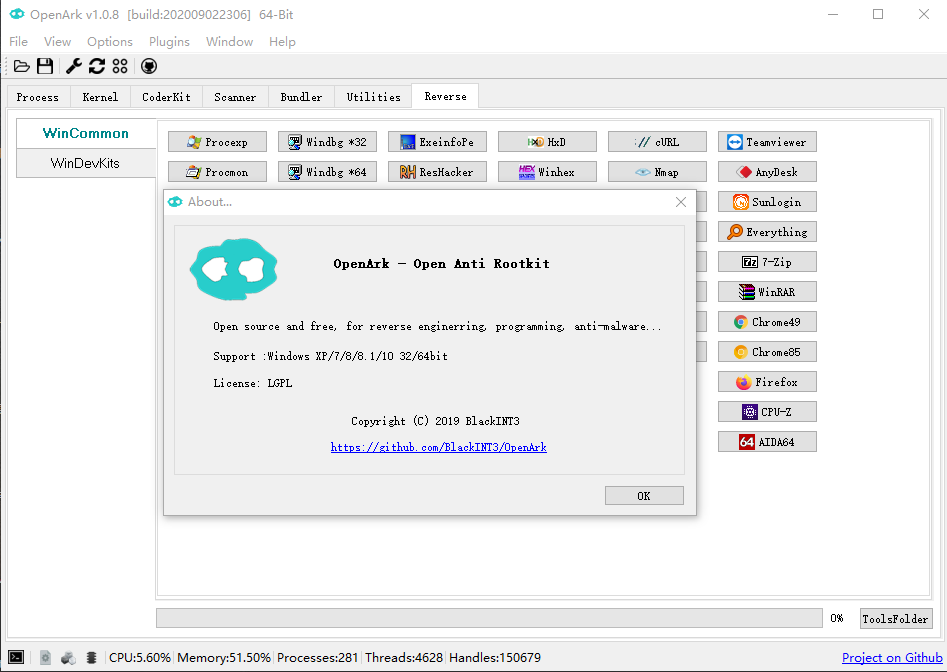
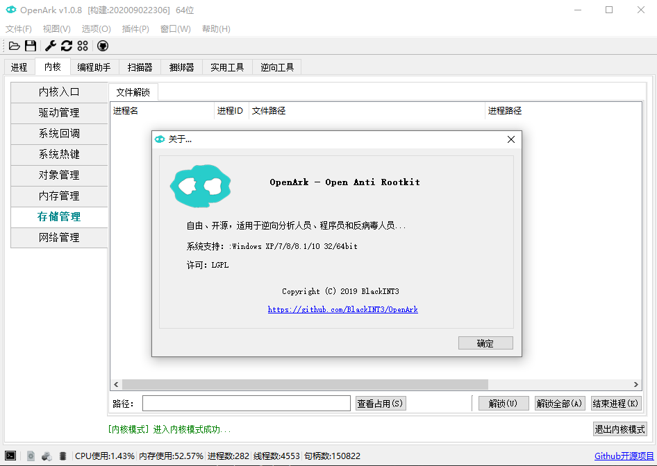

&emsp;&emsp;OpenArk is a open source anti-rookit(Ark) tool on Windows. Ark is Anti Rootkit abbreviated, it aimmed at reversing and programming helper, users also can use it to find out malwares in the OS. More and more commands will be supported in future.

&emsp;&emsp;OpenArk是一款Windows平台上的开源Ark工具. Ark是Anti-Rootkit（对抗恶意程序）的简写, OpenArk目标成为逆向工程师、编程人员的工具，同时也能为那些希望清理恶意软件的用户服务。以后也将会支持更多功能和命令。

Website（官网）: [https://openark.blackint3.com/](https://openark.blackint3.com/)
 
Source（源码）: [https://github.com/BlackINT3/OpenArk/](https://github.com/BlackINT3/OpenArk/)

Manuals(帮助手册): [https://openark.blackint3.com/manuals/](https://openark.blackint3.com/manuals/)
